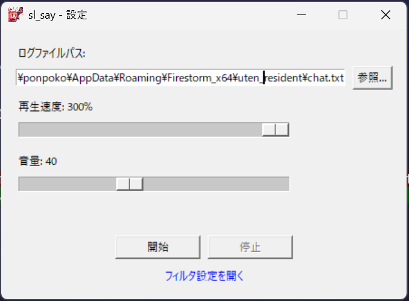

# sl_say

Second Life のチャットログ（chat.txt）をリアルタイムに監視し、新しいメッセージを音声で読み上げるWindows向けツール。Firestormで動作確認済み。他のビューワーでもchat.txt形式が同じであれば動作する可能性があります。

## ダウンロード

[sl_say.exe をダウンロード](https://github.com/uteten/sl_say/raw/main/dist/sl_say.exe) して実行してください。Python環境は不要です。

## 使い方

1. `sl_say.exe` を起動すると設定フォームが表示されます
2. **ログファイルパス**: Firestormの `chat.txt` を指定（参照ボタンでファイル選択可能）
3. **再生速度**: 0-300% でTTS読み上げ速度を調整
4. **音量**: 0-100 で音量を調整
5. 「開始」ボタンで監視を開始。ログがフォーム内に表示されます
6. 「停止」ボタンで監視を停止し、設定を変更して再開可能
7. ウィンドウを閉じるとアプリが終了します

設定（パス・速度・音量）は自動保存され、次回起動時に復元されます。



### フィルタ設定

フォーム下部の「フィルタ設定を開く」リンクから `filters.txt` を編集できます。

- **`[exclude_speaker]`**: 発言者名の除外パターン（オブジェクト等の除外）
- **`[exclude]`**: 発言本文の除外パターン
- **`[replace]`**: 読み上げ時の文字列置換（`re:` プレフィックスで正規表現対応）

初期設定に戻したい場合は `filters.txt` を削除して再起動してください。

## ビルド方法

Windows環境で以下を実行してください。[uv](https://docs.astral.sh/uv/) が必要です。

```
uv run pyinstaller sl_say.spec
```

`dist/sl_say.exe` が生成されます。

## 依存ライブラリ

- [edge-tts](https://pypi.org/project/edge-tts/) - Microsoft Edge TTSによる音声合成（インターネット接続が必要）

## 動作環境

- Windows 10 / 11
- インターネット接続（edge-tts使用のため）
